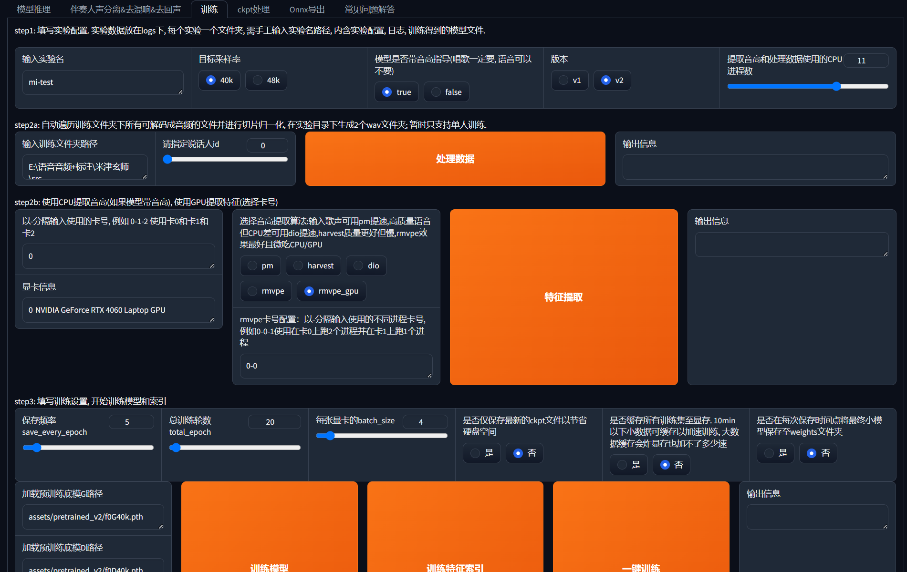

# 基于RVC和Replay的声音转换框架的一种本地部署方案
最近闲来无事，突然有想把朋友声音训练成AI来唱歌的想法。最开始打算使用 So-VITS-SVC 4.0，但这个框架太久没有更新，在部署环境时出现了极难解决的问题，只好作罢。最终决定采用 Retrieval-based-Voice-Conversion-WebUI(RVC) 作为训练和推理框架，在踩过无数的坑之后才得以成功。
网上关于RVC部署的相关的文档过时且很少，并且没有本地部署的教程，所以我写此文档对于本地部署进行记录，望能帮助有同样想法的人。

本人才刚接触这方面的训练和推理，对于这方面知之甚少，所以本文档仅保证部署环节的正确性。请容忍训练和推理方面的错误。敬请指正。<br/>
__事先声明__，本机部署环境为 __Windows11__ 和 __n卡__。若环境不同，文档不保证根据下文能成功进行部署。
## 1. Python 环境搭建
### 1.1. 安装虚拟环境
本文档使用 __miniconda__ 进行 python 虚拟环境的部署。
点 [此处](https://docs.anaconda.com/free/miniconda/) 进入 miniconda 的页面进行下载。
安装后，按`win+r`打开“运行”，输入`cmd`后确定，打开命令行窗口。
1. 输入
```
conda --version
```
若看到窗口显示类似
```
conda 23.10.0
```
的语句，就表示 miniconda 安装成功。
#### 无环境变量的解决方法
若无上述显示，则需要在“环境变量”中对miniconda的以下目录进行添加：
```
your_path\miniconda3
your_path\miniconda3\Library\mingw-w64\bin
your_path\miniconda3\Library\usr\bin
your_path\miniconda3\Library\bin
your_path\miniconda3\Scripts
```
__进入环境变量的方法__：
在“设置”中搜索`编辑系统环境变量`，点击进入。然后按照下图进行操作：

<br/>
可参考：[Windows上Miniconda的安装：一步步教你从零开始](https://blog.csdn.net/qq_41813454/article/details/136111020)
### 1.2 配置虚拟环境
1. `win+r`打开 cmd，并进行如下操作。
_注意：terminal一定要用cmd！win11 默认的 powershell 无法进入 conda 虚拟环境。_
2. 创建虚拟环境
_注：RVC仅支持至少 python3.9 的环境_
```
conda create -n rvc python=3.9
```
出现`Proceed ([y]/n)?`时输入 y 回车。
3. 进入虚拟环境
```
conda activate rvc
```
看见新命令行前出现`(rvc)`时则操作成功。
4. 安装 pytorch
点击进入 [pytorch 官方页面](https://pytorch.org/get-started/locally/)，在如下界面选择对应选项，并复制命令输入 cmd 进行安装。

5. 安装依赖
```
pip install -r requirements.txt
```
若感觉下载速度太慢，可输入
```
pip install -r requirements.txt -i https://pypi.mirrors.ustc.edu.cn/simple
```
6. 更换 numpy 版本
经测试，现 numpy 版本过高，不兼容 RVC 代码版本，故要进行降级。
```
pip install -u numpy==1.23.5
```
到此，python环境部署结束。

## 2. RVC 的部署
### 2.1 下载 RVC
鉴于很多人可能无法科学上网，[此处网盘链接](链接：https://pan.baidu.com/s/1HPWJfhtMOV_w3CsNPoZZQA?pwd=6o1s)打包了RVC的仓库压缩包，并附带了一些必需文件：
```
Retrieval-based-Voice-Conversion-WebUI-main/ffmpeg.exe
Retrieval-based-Voice-Conversion-WebUI-main/ffprobe.exe
Retrieval-based-Voice-Conversion-WebUI-main/assets/hubert/hubert_base.pt
Retrieval-based-Voice-Conversion-WebUI-main/assets/rmpve/rmpve.pt
```
可直接下载解压使用。

若出现问题或有疑问可参考 [RVC 的 github 页面](https://github.com/RVC-Project/Retrieval-based-Voice-Conversion-WebUI?tab=readme-ov-file)。
### 2.2 启动 RVC
在 cmd 中输入下列语句，跳转到 RVC 解压后所在的目录（路径为示例）：
```
cd C:\Retrieval-based-Voice-Conversion-WebUI
```
若存放位置不在 C盘，则需要如下输入（路径为示例）：
```
d:
cd D:\files\study\AI\Retrieval-based-Voice-Conversion-WebUI
```
然后输入下列命令启动RVC WebUI：
```
python infer-web.py
```
在 RVC WebUI 启动后，会弹出一个网站页面。到此，RVC 的部署就完成了。


## 3. 使用 RVC 训练自己的模型
要进行训练，数据集和模型是必不可少的。本仓库的压缩包内已经内置了部分用于处理数据集和用于训练的模型，如需要更多模型，可点击[RVC在 huggingface 的模型仓库](https://huggingface.co/lj1995/VoiceConversionWebUI/tree/main)进行浏览下载。
### 3.1 处理声源（数据集）
点击跳转到如下页面“伴奏人声分离&去混响&去回声”。

准备一定长度的用于训练的音频，官方推荐长度最好在10-50min，如果音频质量好，可以只准备5-10min。

将音频文件夹路径输入到页面中，也可以直接将音频文件拖入。模型先使用HP2跑一遍，再使用DeEcho-Aggressive跑一遍。（这里我对于这些模型的使用还没有研究透彻，这不是最优方案，暂时照这个做就行）

输出文件夹在没有指定的情况下，会存放在项目根目录的`opt`文件夹下，也可自己指定输出目录。
### 3.2 训练
点击跳转到如下页面“训练”。

实验名自定义，训练文件夹路径选择处理过的声源文件夹，保证文件夹内只有处理过的人声存在。剩下的可以不用更改。

关于训练轮数，在数据集音质较差的情况下，20-30即可。如果数据集音质很好，可以加大训练力度。

点击“一键训练”等待训练结束。训练结束后会在`.\assets\weights`下生成最终的.pth文件，在`.\assets\indices`下生成最终的.index文件。
## 3 推理生成AI歌曲
### 3.1 Replay的下载安装
使用 Replay app 对训练出的模型进行推理。Replay 在[此处链接](https://www.123pan.com/s/uSmfjv-iFrCA.html)进行下载。
下载完成解压后，按如下步骤进行安装。
1. 运行“Windows_Replay-3.3.0-installer.exe”
2. 在`win+r`地址栏输入“%AppData%\Replay”，将“Windows版文件.zip”文件解压覆盖到文件夹中
    若提示文件夹不存在，先在地址栏输入“%AppData%”进入文件夹，寻找 Replay 是否存在，若不存在，先打开一遍安装好的软件，待其生成后再进行操作。
    补充：软件版本和运行文件是相关联的，所以请一定要使用网盘里的安装包，并且不要更新！不要更新！不要更新！！！
### 3.2 Replay的使用
1. 运行软件，若弹窗选择“Not Now”
2. 将想听的歌曲拖入下面的框中。

3. 将要推理的模型放入下面的框中，模型位于RVC项目的`.\assets\weights`中。

4. 点击最下方的按钮生成

然后就能听到AI歌曲了。<br/>
参考：[Replay+RVC极简操作：四步操作替换声音，分分钟秒实现AI唱歌](https://cloud.tencent.com/developer/news/1298807)

## 参考
RVC github: https://github.com/RVC-Project/Retrieval-based-Voice-Conversion-WebUI?tab=readme-ov-file

RVC 使用模型：https://huggingface.co/lj1995/VoiceConversionWebUI/tree/main

Replay+RVC极简操作：四步操作替换声音，分分钟秒实现AI唱歌：
https://cloud.tencent.com/developer/news/1298807
